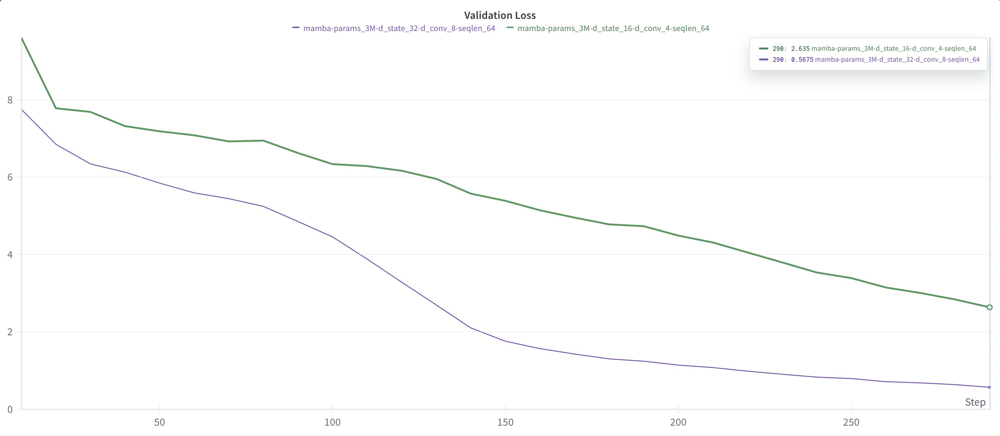

# Mamba-JAX

Welcome to the Mamba-JAX repository! This is a passion project that utilizes the Mamba training pipeline, built on the JAX framework.

At present, I am able to train a small-scale Mamba model on my MacBook. I am excited to share with you the convergence curve based on Shakespeare's works.



# TODOs

- [ ] Implement gradient accumulation.
- [ ] Implement activation memory checkpoint.
- [ ] Add GPU-aware selective scan.

# Citation

```
@article{mamba,
  title={Mamba: Linear-Time Sequence Modeling with Selective State Spaces},
  author={Gu, Albert and Dao, Tri},
  journal={arXiv preprint arXiv:2312.00752},
  year={2023}
}
```
